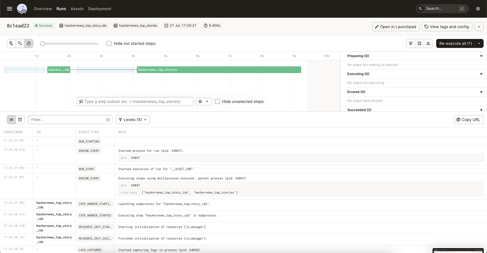
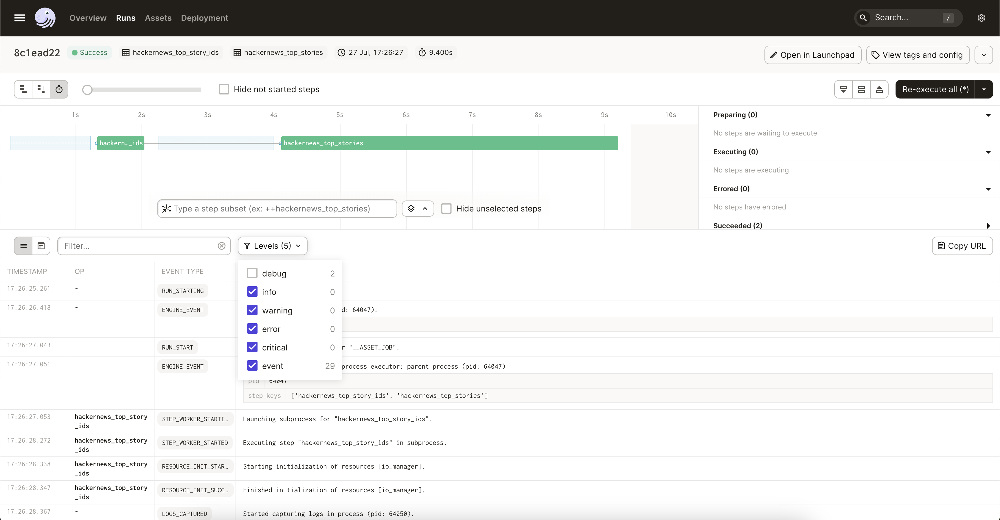
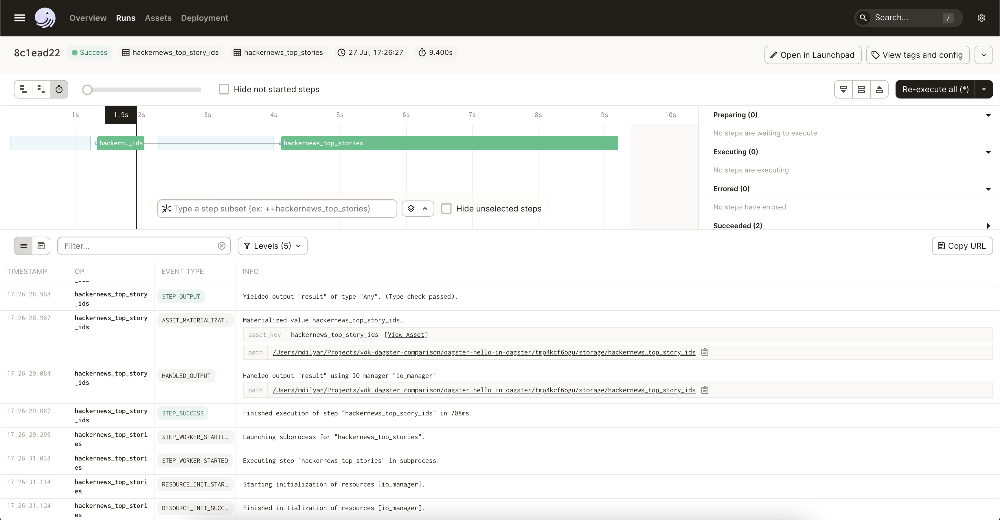
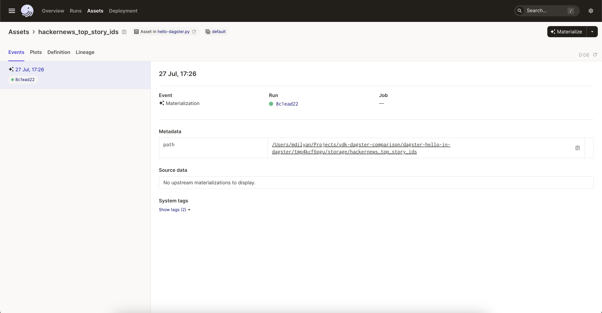
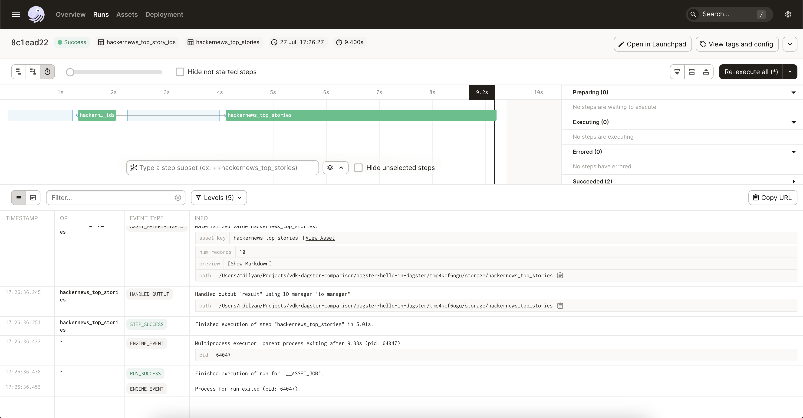
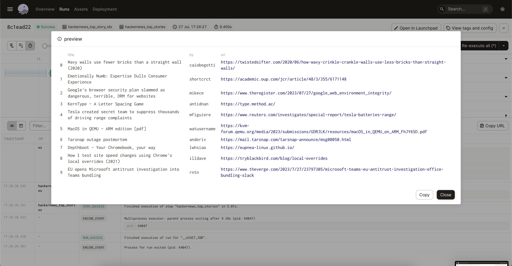
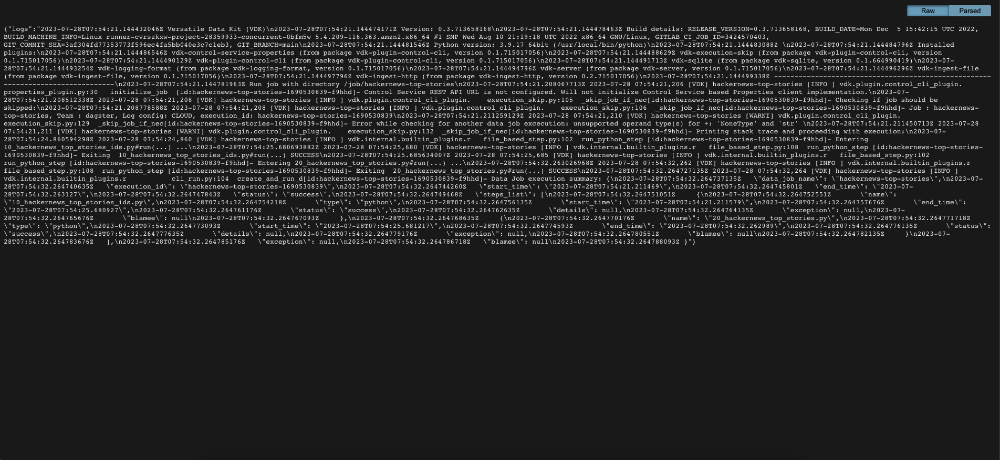
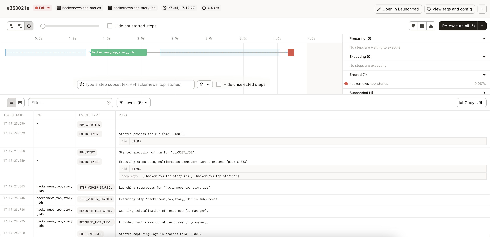
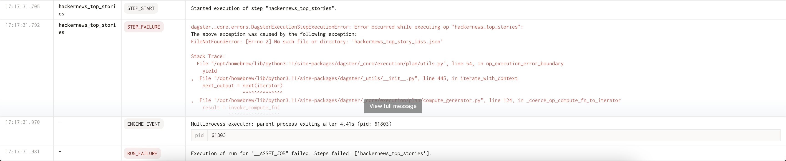
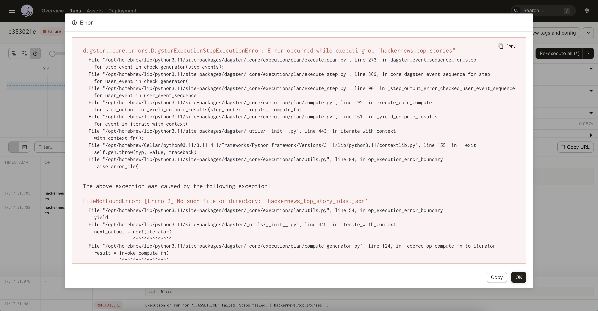

# vdk-dagster-comparison

# Overview

This comparison looks at several examples of the same data job executed both in
dagster and vdk. After each example, logs from successful and failed runs for
both jobs are analyzed and compared on the basis of usability and readability.

# Analysis

## Dagster

## VDK

## Areas of improvement

# Logs Examples

## Hello Dagster

This data job fetches the top 10 hacker news stories ids, creates an adjaceny
list of child stories and stores various other metadata in a csv format. We run
it once successfully and look at the logs. We then break it, by pointing to a
non-existant json file in the second step and look at the logs again

### Successful Local Run

**Dagster**

```
2023-07-27 17:25:52 +0300 - dagster - INFO - Using temporary directory /Users/mdilyan/Projects/vdk-dagster-comparison/dagster-hello-in-dagster/tmp4kcf6ogu for storage. This will be removed when dagster dev exits.
2023-07-27 17:25:52 +0300 - dagster - INFO - To persist information across sessions, set the environment variable DAGSTER_HOME to a directory to use.
2023-07-27 17:25:53 +0300 - dagster - INFO - Launching Dagster services...
2023-07-27 17:25:55 +0300 - dagster.daemon - INFO - Instance is configured with the following daemons: ['AssetDaemon', 'BackfillDaemon', 'SchedulerDaemon', 'SensorDaemon']
2023-07-27 17:25:55 +0300 - dagster.daemon.SensorDaemon - INFO - Not checking for any runs since no sensors have been started.
2023-07-27 17:25:55 +0300 - dagster-webserver - INFO - Serving dagster-webserver on http://127.0.0.1:3000 in process 64030
2023-07-27 17:26:27 +0300 - dagster - DEBUG - __ASSET_JOB - 8c1ead22-48ff-4690-9009-810552b925a3 - 64047 - RUN_START - Started execution of run for "__ASSET_JOB".
2023-07-27 17:26:27 +0300 - dagster - DEBUG - __ASSET_JOB - 8c1ead22-48ff-4690-9009-810552b925a3 - 64047 - ENGINE_EVENT - Executing steps using multiprocess executor: parent process (pid: 64047)
2023-07-27 17:26:27 +0300 - dagster - DEBUG - __ASSET_JOB - 8c1ead22-48ff-4690-9009-810552b925a3 - 64047 - hackernews_top_story_ids - STEP_WORKER_STARTING - Launching subprocess for "hackernews_top_story_ids".
2023-07-27 17:26:28 +0300 - dagster - DEBUG - __ASSET_JOB - 8c1ead22-48ff-4690-9009-810552b925a3 - 64050 - STEP_WORKER_STARTED - Executing step "hackernews_top_story_ids" in subprocess.
2023-07-27 17:26:28 +0300 - dagster - DEBUG - __ASSET_JOB - 8c1ead22-48ff-4690-9009-810552b925a3 - 64050 - hackernews_top_story_ids - RESOURCE_INIT_STARTED - Starting initialization of resources [io_manager].
2023-07-27 17:26:28 +0300 - dagster - DEBUG - __ASSET_JOB - 8c1ead22-48ff-4690-9009-810552b925a3 - 64050 - hackernews_top_story_ids - RESOURCE_INIT_SUCCESS - Finished initialization of resources [io_manager].
2023-07-27 17:26:28 +0300 - dagster - DEBUG - __ASSET_JOB - 8c1ead22-48ff-4690-9009-810552b925a3 - 64050 - LOGS_CAPTURED - Started capturing logs in process (pid: 64050).
2023-07-27 17:26:28 +0300 - dagster - DEBUG - __ASSET_JOB - 8c1ead22-48ff-4690-9009-810552b925a3 - 64050 - hackernews_top_story_ids - STEP_START - Started execution of step "hackernews_top_story_ids".
2023-07-27 17:26:28 +0300 - dagster - DEBUG - __ASSET_JOB - 8c1ead22-48ff-4690-9009-810552b925a3 - 64050 - hackernews_top_story_ids - STEP_OUTPUT - Yielded output "result" of type "Any". (Type check passed).
2023-07-27 17:26:28 +0300 - dagster - DEBUG - __ASSET_JOB - 8c1ead22-48ff-4690-9009-810552b925a3 - hackernews_top_story_ids - Writing file at: /Users/mdilyan/Projects/vdk-dagster-comparison/dagster-hello-in-dagster/tmp4kcf6ogu/storage/hackernews_top_story_ids using PickledObjectFilesystemIOManager...
2023-07-27 17:26:29 +0300 - dagster - DEBUG - __ASSET_JOB - 8c1ead22-48ff-4690-9009-810552b925a3 - 64050 - hackernews_top_story_ids - ASSET_MATERIALIZATION - Materialized value hackernews_top_story_ids.
2023-07-27 17:26:29 +0300 - dagster - DEBUG - __ASSET_JOB - 8c1ead22-48ff-4690-9009-810552b925a3 - 64050 - hackernews_top_story_ids - HANDLED_OUTPUT - Handled output "result" using IO manager "io_manager"
2023-07-27 17:26:29 +0300 - dagster - DEBUG - __ASSET_JOB - 8c1ead22-48ff-4690-9009-810552b925a3 - 64047 - hackernews_top_stories - STEP_WORKER_STARTING - Launching subprocess for "hackernews_top_stories".
2023-07-27 17:26:31 +0300 - dagster - DEBUG - __ASSET_JOB - 8c1ead22-48ff-4690-9009-810552b925a3 - 64057 - STEP_WORKER_STARTED - Executing step "hackernews_top_stories" in subprocess.
2023-07-27 17:26:31 +0300 - dagster - DEBUG - __ASSET_JOB - 8c1ead22-48ff-4690-9009-810552b925a3 - 64057 - hackernews_top_stories - RESOURCE_INIT_STARTED - Starting initialization of resources [io_manager].
2023-07-27 17:26:31 +0300 - dagster - DEBUG - __ASSET_JOB - 8c1ead22-48ff-4690-9009-810552b925a3 - 64057 - hackernews_top_stories - RESOURCE_INIT_SUCCESS - Finished initialization of resources [io_manager].
2023-07-27 17:26:31 +0300 - dagster - DEBUG - __ASSET_JOB - 8c1ead22-48ff-4690-9009-810552b925a3 - 64057 - LOGS_CAPTURED - Started capturing logs in process (pid: 64057).
2023-07-27 17:26:31 +0300 - dagster - DEBUG - __ASSET_JOB - 8c1ead22-48ff-4690-9009-810552b925a3 - 64057 - hackernews_top_stories - STEP_START - Started execution of step "hackernews_top_stories".
2023-07-27 17:26:36 +0300 - dagster - DEBUG - __ASSET_JOB - 8c1ead22-48ff-4690-9009-810552b925a3 - 64057 - hackernews_top_stories - STEP_OUTPUT - Yielded output "result" of type "Any". (Type check passed).
2023-07-27 17:26:36 +0300 - dagster - DEBUG - __ASSET_JOB - 8c1ead22-48ff-4690-9009-810552b925a3 - hackernews_top_stories - Writing file at: /Users/mdilyan/Projects/vdk-dagster-comparison/dagster-hello-in-dagster/tmp4kcf6ogu/storage/hackernews_top_stories using PickledObjectFilesystemIOManager...
2023-07-27 17:26:36 +0300 - dagster - DEBUG - __ASSET_JOB - 8c1ead22-48ff-4690-9009-810552b925a3 - 64057 - hackernews_top_stories - ASSET_MATERIALIZATION - Materialized value hackernews_top_stories.
2023-07-27 17:26:36 +0300 - dagster - DEBUG - __ASSET_JOB - 8c1ead22-48ff-4690-9009-810552b925a3 - 64057 - hackernews_top_stories - HANDLED_OUTPUT - Handled output "result" using IO manager "io_manager"
2023-07-27 17:26:36 +0300 - dagster - DEBUG - __ASSET_JOB - 8c1ead22-48ff-4690-9009-810552b925a3 - 64047 - ENGINE_EVENT - Multiprocess executor: parent process exiting after 9.38s (pid: 64047)
2023-07-27 17:26:36 +0300 - dagster - DEBUG - __ASSET_JOB - 8c1ead22-48ff-4690-9009-810552b925a3 - 64047 - RUN_SUCCESS - Finished execution of run for "__ASSET_JOB".
```

**VDK**

```
Versatile Data Kit (VDK)
Version: 0.3.944573153
Build details: RELEASE_VERSION=0.3.944573153, BUILD_DATE=Tue Jul 25 10:49:05 UTC 2023, BUILD_MACHINE_INFO=Linux runner-5w-mmpfk-project-28359933-concurrent-09ktj5 5.4.235-144.344.amzn2.x86_64 #1 SMP Sun Mar 12 12:50:22 UTC 2023 x86_64 GNU/Linux, GITLAB_CI_JOB_ID=4735221896, GIT_COMMIT_SHA=94717d382deb75b5c3b23992b13a75e1bd0e384b, GIT_BRANCH=main
Python version: 3.11.4 64bit (/opt/homebrew/opt/python@3.11/bin/python3.11)

Installed plugins:
vdk-server (from package vdk-server, version 0.1.927572457)
vdk-sqlite (from package vdk-sqlite, version 0.1.824443273)
vdk-control-service-properties (from package vdk-plugin-control-cli, version 0.1.928743296)
vdk-execution-skip (from package vdk-plugin-control-cli, version 0.1.928743296)
vdk-plugin-control-cli (from package vdk-plugin-control-cli, version 0.1.928743296)
vdk-ingest-file (from package vdk-ingest-file, version 0.1.824443273)
vdk-ingest-http (from package vdk-ingest-http, version 0.2.824443273)
vdk-logging-format (from package vdk-logging-format, version 0.1.824443273)
--------------------------------------------------------------------------------
Run job with directory /Users/mdilyan/Projects/vdk-dagster-comparison/dagster-hello-in-vdk/hackernews-top-stories
2023-07-27 17:50:44,918 [VDK] hackernews-top-stories [INFO ] vdk.plugin.control_cli_plugin. properties_plugin.py:30   initialize_job  [id:30618c1b-677b-4f96-86a3-dda26011b3d8-1690469444-20a99]- Control Service REST API URL is not configured. Will not initialize Control Service based Properties client implementation.
2023-07-27 17:50:44,918 [VDK] hackernews-top-stories [INFO ] vdk.plugin.control_cli_plugin.    execution_skip.py:105  _skip_job_if_nec[id:30618c1b-677b-4f96-86a3-dda26011b3d8-1690469444-20a99]- Checking if job should be skipped:
2023-07-27 17:50:44,918 [VDK] hackernews-top-stories [INFO ] vdk.plugin.control_cli_plugin.    execution_skip.py:106  _skip_job_if_nec[id:30618c1b-677b-4f96-86a3-dda26011b3d8-1690469444-20a99]- Job : hackernews-top-stories, Team : dagster, Log config: LOCAL, execution_id: 30618c1b-677b-4f96-86a3-dda26011b3d8-1690469444
2023-07-27 17:50:44,918 [VDK] hackernews-top-stories [INFO ] root                              execution_skip.py:111  _skip_job_if_nec[id:30618c1b-677b-4f96-86a3-dda26011b3d8-1690469444-20a99]- Local execution, skipping parallel execution check.
2023-07-27 17:50:45,330 [VDK] hackernews-top-stories [INFO ] vdk.internal.builtin_plugins.r   file_based_step.py:102  run_python_step [id:30618c1b-677b-4f96-86a3-dda26011b3d8-1690469444-20a99]- Entering 10_hackernews_top_stories_ids.py#run(...) ...
2023-07-27 17:50:45,909 [VDK] hackernews-top-stories [INFO ] vdk.internal.builtin_plugins.r   file_based_step.py:108  run_python_step [id:30618c1b-677b-4f96-86a3-dda26011b3d8-1690469444-20a99]- Exiting  10_hackernews_top_stories_ids.py#run(...) SUCCESS
2023-07-27 17:50:45,911 [VDK] hackernews-top-stories [INFO ] vdk.internal.builtin_plugins.r   file_based_step.py:102  run_python_step [id:30618c1b-677b-4f96-86a3-dda26011b3d8-1690469444-20a99]- Entering 20_hackernews_top_stories.py#run(...) ...
2023-07-27 17:50:50,105 [VDK] hackernews-top-stories [INFO ] vdk.internal.builtin_plugins.r   file_based_step.py:108  run_python_step [id:30618c1b-677b-4f96-86a3-dda26011b3d8-1690469444-20a99]- Exiting  20_hackernews_top_stories.py#run(...) SUCCESS
2023-07-27 17:50:50,105 [VDK] hackernews-top-stories [INFO ] vdk.internal.builtin_plugins.r           cli_run.py:162  create_and_run_d[id:30618c1b-677b-4f96-86a3-dda26011b3d8-1690469444-20a99]- Data Job execution summary: {
  "data_job_name": "hackernews-top-stories",
  "execution_id": "30618c1b-677b-4f96-86a3-dda26011b3d8-1690469444",
  "start_time": "2023-07-27T14:50:44.918914",
  "end_time": "2023-07-27T14:50:50.105634",
  "status": "success",
  "steps_list": [
    {
      "name": "10_hackernews_top_stories_ids.py",
      "type": "python",
      "start_time": "2023-07-27T14:50:44.918923",
      "end_time": "2023-07-27T14:50:45.909415",
      "status": "success",
      "details": null,
      "exception": null,
      "blamee": null
    },
    {
      "name": "20_hackernews_top_stories.py",
      "type": "python",
      "start_time": "2023-07-27T14:50:45.909497",
      "end_time": "2023-07-27T14:50:50.105591",
      "status": "success",
      "details": null,
      "exception": null,
      "blamee": null
    }
  ],
  "exception": null,
  "blamee": null
}

```
### Failed Local Run

**Dagster**

```
2023-07-27 17:17:02 +0300 - dagster - INFO - Using temporary directory /Users/mdilyan/Projects/vdk-dagster-comparison/dagster-hello-in-dagster/tmpz8s1rjmt for storage. This will be removed when dagster dev exits.
2023-07-27 17:17:02 +0300 - dagster - INFO - To persist information across sessions, set the environment variable DAGSTER_HOME to a directory to use.
2023-07-27 17:17:04 +0300 - dagster - INFO - Launching Dagster services...
2023-07-27 17:17:07 +0300 - dagster.daemon - INFO - Instance is configured with the following daemons: ['AssetDaemon', 'BackfillDaemon', 'SchedulerDaemon', 'SensorDaemon']
2023-07-27 17:17:08 +0300 - dagster.daemon.SensorDaemon - INFO - Not checking for any runs since no sensors have been started.
2023-07-27 17:17:08 +0300 - dagster-webserver - INFO - Serving dagster-webserver on http://127.0.0.1:3000 in process 61735
2023-07-27 17:17:27 +0300 - dagster - DEBUG - __ASSET_JOB - e353021e-8236-4121-a43f-749ff3bc5431 - 61803 - RUN_START - Started execution of run for "__ASSET_JOB".
2023-07-27 17:17:27 +0300 - dagster - DEBUG - __ASSET_JOB - e353021e-8236-4121-a43f-749ff3bc5431 - 61803 - ENGINE_EVENT - Executing steps using multiprocess executor: parent process (pid: 61803)
2023-07-27 17:17:27 +0300 - dagster - DEBUG - __ASSET_JOB - e353021e-8236-4121-a43f-749ff3bc5431 - 61803 - hackernews_top_story_ids - STEP_WORKER_STARTING - Launching subprocess for "hackernews_top_story_ids".
2023-07-27 17:17:28 +0300 - dagster - DEBUG - __ASSET_JOB - e353021e-8236-4121-a43f-749ff3bc5431 - 61808 - STEP_WORKER_STARTED - Executing step "hackernews_top_story_ids" in subprocess.
2023-07-27 17:17:28 +0300 - dagster - DEBUG - __ASSET_JOB - e353021e-8236-4121-a43f-749ff3bc5431 - 61808 - hackernews_top_story_ids - RESOURCE_INIT_STARTED - Starting initialization of resources [io_manager].
2023-07-27 17:17:28 +0300 - dagster - DEBUG - __ASSET_JOB - e353021e-8236-4121-a43f-749ff3bc5431 - 61808 - hackernews_top_story_ids - RESOURCE_INIT_SUCCESS - Finished initialization of resources [io_manager].
2023-07-27 17:17:28 +0300 - dagster - DEBUG - __ASSET_JOB - e353021e-8236-4121-a43f-749ff3bc5431 - 61808 - LOGS_CAPTURED - Started capturing logs in process (pid: 61808).
2023-07-27 17:17:28 +0300 - dagster - DEBUG - __ASSET_JOB - e353021e-8236-4121-a43f-749ff3bc5431 - 61808 - hackernews_top_story_ids - STEP_START - Started execution of step "hackernews_top_story_ids".
2023-07-27 17:17:29 +0300 - dagster - DEBUG - __ASSET_JOB - e353021e-8236-4121-a43f-749ff3bc5431 - 61808 - hackernews_top_story_ids - STEP_OUTPUT - Yielded output "result" of type "Any". (Type check passed).
2023-07-27 17:17:29 +0300 - dagster - DEBUG - __ASSET_JOB - e353021e-8236-4121-a43f-749ff3bc5431 - hackernews_top_story_ids - Writing file at: /Users/mdilyan/Projects/vdk-dagster-comparison/dagster-hello-in-dagster/tmpz8s1rjmt/storage/hackernews_top_story_ids using PickledObjectFilesystemIOManager...
2023-07-27 17:17:29 +0300 - dagster - DEBUG - __ASSET_JOB - e353021e-8236-4121-a43f-749ff3bc5431 - 61808 - hackernews_top_story_ids - ASSET_MATERIALIZATION - Materialized value hackernews_top_story_ids.
2023-07-27 17:17:29 +0300 - dagster - DEBUG - __ASSET_JOB - e353021e-8236-4121-a43f-749ff3bc5431 - 61808 - hackernews_top_story_ids - HANDLED_OUTPUT - Handled output "result" using IO manager "io_manager"
2023-07-27 17:17:29 +0300 - dagster - DEBUG - __ASSET_JOB - e353021e-8236-4121-a43f-749ff3bc5431 - 61803 - hackernews_top_stories - STEP_WORKER_STARTING - Launching subprocess for "hackernews_top_stories".
2023-07-27 17:17:31 +0300 - dagster - DEBUG - __ASSET_JOB - e353021e-8236-4121-a43f-749ff3bc5431 - 61815 - STEP_WORKER_STARTED - Executing step "hackernews_top_stories" in subprocess.
2023-07-27 17:17:31 +0300 - dagster - DEBUG - __ASSET_JOB - e353021e-8236-4121-a43f-749ff3bc5431 - 61815 - hackernews_top_stories - RESOURCE_INIT_STARTED - Starting initialization of resources [io_manager].
2023-07-27 17:17:31 +0300 - dagster - DEBUG - __ASSET_JOB - e353021e-8236-4121-a43f-749ff3bc5431 - 61815 - hackernews_top_stories - RESOURCE_INIT_SUCCESS - Finished initialization of resources [io_manager].
2023-07-27 17:17:31 +0300 - dagster - DEBUG - __ASSET_JOB - e353021e-8236-4121-a43f-749ff3bc5431 - 61815 - LOGS_CAPTURED - Started capturing logs in process (pid: 61815).
2023-07-27 17:17:31 +0300 - dagster - DEBUG - __ASSET_JOB - e353021e-8236-4121-a43f-749ff3bc5431 - 61815 - hackernews_top_stories - STEP_START - Started execution of step "hackernews_top_stories".
2023-07-27 17:17:31 +0300 - dagster - DEBUG - __ASSET_JOB - e353021e-8236-4121-a43f-749ff3bc5431 - 61803 - ENGINE_EVENT - Multiprocess executor: parent process exiting after 4.41s (pid: 61803)
2023-07-27 17:17:31 +0300 - dagster - ERROR - __ASSET_JOB - e353021e-8236-4121-a43f-749ff3bc5431 - 61803 - RUN_FAILURE - Execution of run for "__ASSET_JOB" failed. Steps failed: ['hackernews_top_stories'].
2023-07-27 17:18:08 +0300 - dagster.daemon.SensorDaemon - INFO - Not checking for any runs since no sensors have been started.
```

**VDK**

```
Versatile Data Kit (VDK)
Version: 0.3.944573153
Build details: RELEASE_VERSION=0.3.944573153, BUILD_DATE=Tue Jul 25 10:49:05 UTC 2023, BUILD_MACHINE_INFO=Linux runner-5w-mmpfk-project-28359933-concurrent-09ktj5 5.4.235-144.344.amzn2.x86_64 #1 SMP Sun Mar 12 12:50:22 UTC 2023 x86_64 GNU/Linux, GITLAB_CI_JOB_ID=4735221896, GIT_COMMIT_SHA=94717d382deb75b5c3b23992b13a75e1bd0e384b, GIT_BRANCH=main
Python version: 3.11.4 64bit (/opt/homebrew/opt/python@3.11/bin/python3.11)

Installed plugins:
vdk-server (from package vdk-server, version 0.1.927572457)
vdk-sqlite (from package vdk-sqlite, version 0.1.824443273)
vdk-control-service-properties (from package vdk-plugin-control-cli, version 0.1.928743296)
vdk-execution-skip (from package vdk-plugin-control-cli, version 0.1.928743296)
vdk-plugin-control-cli (from package vdk-plugin-control-cli, version 0.1.928743296)
vdk-ingest-file (from package vdk-ingest-file, version 0.1.824443273)
vdk-ingest-http (from package vdk-ingest-http, version 0.2.824443273)
vdk-logging-format (from package vdk-logging-format, version 0.1.824443273)
--------------------------------------------------------------------------------
Run job with directory /Users/mdilyan/Projects/vdk-dagster-comparison/dagster-hello-in-vdk/hackernews-top-stories
2023-07-27 17:53:18,834 [VDK] hackernews-top-stories [INFO ] vdk.plugin.control_cli_plugin. properties_plugin.py:30   initialize_job  [id:5a41942f-bb1a-4bb7-8d4e-b2fa38027127-1690469598-b8872]- Control Service REST API URL is not configured. Will not initialize Control Service based Properties client implementation.
2023-07-27 17:53:18,834 [VDK] hackernews-top-stories [INFO ] vdk.plugin.control_cli_plugin.    execution_skip.py:105  _skip_job_if_nec[id:5a41942f-bb1a-4bb7-8d4e-b2fa38027127-1690469598-b8872]- Checking if job should be skipped:
2023-07-27 17:53:18,834 [VDK] hackernews-top-stories [INFO ] vdk.plugin.control_cli_plugin.    execution_skip.py:106  _skip_job_if_nec[id:5a41942f-bb1a-4bb7-8d4e-b2fa38027127-1690469598-b8872]- Job : hackernews-top-stories, Team : dagster, Log config: LOCAL, execution_id: 5a41942f-bb1a-4bb7-8d4e-b2fa38027127-1690469598
2023-07-27 17:53:18,834 [VDK] hackernews-top-stories [INFO ] root                              execution_skip.py:111  _skip_job_if_nec[id:5a41942f-bb1a-4bb7-8d4e-b2fa38027127-1690469598-b8872]- Local execution, skipping parallel execution check.
2023-07-27 17:53:19,230 [VDK] hackernews-top-stories [INFO ] vdk.internal.builtin_plugins.r   file_based_step.py:102  run_python_step [id:5a41942f-bb1a-4bb7-8d4e-b2fa38027127-1690469598-b8872]- Entering 10_hackernews_top_stories_ids.py#run(...) ...
2023-07-27 17:53:19,653 [VDK] hackernews-top-stories [INFO ] vdk.internal.builtin_plugins.r   file_based_step.py:108  run_python_step [id:5a41942f-bb1a-4bb7-8d4e-b2fa38027127-1690469598-b8872]- Exiting  10_hackernews_top_stories_ids.py#run(...) SUCCESS
2023-07-27 17:53:19,656 [VDK] hackernews-top-stories [INFO ] vdk.internal.builtin_plugins.r   file_based_step.py:102  run_python_step [id:5a41942f-bb1a-4bb7-8d4e-b2fa38027127-1690469598-b8872]- Entering 20_hackernews_top_stories.py#run(...) ...
2023-07-27 17:53:19,661 [VDK] hackernews-top-stories [ERROR] vdk.internal.builtin_plugins.r            errors.py:438  log_and_rethrow [id:5a41942f-bb1a-4bb7-8d4e-b2fa38027127-1690469598-b8872]- An error in data job code  occurred. The error should be resolved by ResolvableByActual.USER. Here are the details:
  WHAT HAPPENED : Data Job step 20_hackernews_top_stories.py completed with error.
WHY IT HAPPENED : An exception occurred, exception message was: [Errno 2] No such file or directory: 'hackernews_top_story_ids_does_not_exist.json'
   CONSEQUENCES : I will not process the remaining steps (if any), and this Data Job execution will be marked as failed.
COUNTERMEASURES : See exception and fix the root cause, so that the exception does not appear anymore.
Traceback (most recent call last):
  File "/opt/homebrew/lib/python3.11/site-packages/vdk/internal/builtin_plugins/run/file_based_step.py", line 139, in invoke_run_function
    func(**actual_arguments)
  File "/Users/mdilyan/Projects/vdk-dagster-comparison/dagster-hello-in-vdk/hackernews-top-stories/20_hackernews_top_stories.py", line 15, in run
    with open("hackernews_top_story_ids_does_not_exist.json", "r") as f:
         ^^^^^^^^^^^^^^^^^^^^^^^^^^^^^^^^^^^^^^^^^^^^^^^^^^^^^^^^^
FileNotFoundError: [Errno 2] No such file or directory: 'hackernews_top_story_ids_does_not_exist.json'
2023-07-27 17:53:19,661 [VDK] hackernews-top-stories [ERROR] vdk.internal.builtin_plugins.r   file_based_step.py:111  run_python_step [id:5a41942f-bb1a-4bb7-8d4e-b2fa38027127-1690469598-b8872]- Exiting  20_hackernews_top_stories.py#run(...) FAILURE
2023-07-27 17:53:19,661 [VDK] hackernews-top-stories [ERROR] vdk.internal.builtin_plugins.r            errors.py:349  log_exception   [id:5a41942f-bb1a-4bb7-8d4e-b2fa38027127-1690469598-b8872]- An error in data job code  occurred. The error should be resolved by ResolvableByActual.USER. Here are the details:
  WHAT HAPPENED : Processing step 20_hackernews_top_stories.py completed with error.
WHY IT HAPPENED : An exception occurred, exception message was: An error in data job code  occurred. The error should be resolved by ResolvableByActual.USER. Here are the details:
  WHAT HAPPENED : Data Job step 20_hackernews_top_stories.py completed with error.
WHY IT HAPPENED : An exception occurred, exception message was: [Errno 2] No such file or directory: 'hackernews_top_story_ids_does_not_exist.json'
   CONSEQUENCES : I will not process the remaining steps (if any), and this Data Job execution will be marked as failed.
COUNTERMEASURES : See exception and fix the root cause, so that the exception does not appear anymore.
   CONSEQUENCES : I will not process the remaining steps (if any), and this Data Job execution will be marked as failed.
COUNTERMEASURES : See exception and fix the root cause, so that the exception does not appear anymore.
Traceback (most recent call last):
  File "/opt/homebrew/lib/python3.11/site-packages/vdk/internal/builtin_plugins/run/file_based_step.py", line 139, in invoke_run_function
    func(**actual_arguments)
  File "/Users/mdilyan/Projects/vdk-dagster-comparison/dagster-hello-in-vdk/hackernews-top-stories/20_hackernews_top_stories.py", line 15, in run
    with open("hackernews_top_story_ids_does_not_exist.json", "r") as f:
         ^^^^^^^^^^^^^^^^^^^^^^^^^^^^^^^^^^^^^^^^^^^^^^^^^^^^^^^^^
FileNotFoundError: [Errno 2] No such file or directory: 'hackernews_top_story_ids_does_not_exist.json'

The above exception was the direct cause of the following exception:

Traceback (most recent call last):
  File "/opt/homebrew/lib/python3.11/site-packages/vdk/internal/builtin_plugins/run/data_job.py", line 73, in run_step
    step_executed = step.runner_func(step, context.job_input)
                    ^^^^^^^^^^^^^^^^^^^^^^^^^^^^^^^^^^^^^^^^^
  File "/opt/homebrew/lib/python3.11/site-packages/vdk/internal/builtin_plugins/run/file_based_step.py", line 103, in run_python_step
    StepFuncFactory.invoke_run_function(func, job_input, step.name)
  File "/opt/homebrew/lib/python3.11/site-packages/vdk/internal/builtin_plugins/run/file_based_step.py", line 152, in invoke_run_function
    errors.log_and_rethrow(
  File "/opt/homebrew/lib/python3.11/site-packages/vdk/internal/core/errors.py", line 442, in log_and_rethrow
    raise to_be_raised_exception from exception if wrap_in_vdk_error else exception
vdk.internal.core.errors.UserCodeError: An error in data job code  occurred. The error should be resolved by ResolvableByActual.USER. Here are the details:
  WHAT HAPPENED : Data Job step 20_hackernews_top_stories.py completed with error.
WHY IT HAPPENED : An exception occurred, exception message was: [Errno 2] No such file or directory: 'hackernews_top_story_ids_does_not_exist.json'
   CONSEQUENCES : I will not process the remaining steps (if any), and this Data Job execution will be marked as failed.
COUNTERMEASURES : See exception and fix the root cause, so that the exception does not appear anymore.
2023-07-27 17:53:19,668 [VDK] hackernews-top-stories [INFO ] vdk.internal.builtin_plugins.r           cli_run.py:162  create_and_run_d[id:5a41942f-bb1a-4bb7-8d4e-b2fa38027127-1690469598-b8872]- Data Job execution summary: {
  "data_job_name": "hackernews-top-stories",
  "execution_id": "5a41942f-bb1a-4bb7-8d4e-b2fa38027127-1690469598",
  "start_time": "2023-07-27T14:53:18.834284",
  "end_time": "2023-07-27T14:53:19.668033",
  "status": "error",
  "steps_list": [
    {
      "name": "10_hackernews_top_stories_ids.py",
      "type": "python",
      "start_time": "2023-07-27T14:53:18.834293",
      "end_time": "2023-07-27T14:53:19.654124",
      "status": "success",
      "details": null,
      "exception": null,
      "blamee": null
    },
    {
      "name": "20_hackernews_top_stories.py",
      "type": "python",
      "start_time": "2023-07-27T14:53:19.654205",
      "end_time": "2023-07-27T14:53:19.668004",
      "status": "error",
      "details": "An exception occurred, exception message was: An error in data job code  occurred. The error should be resolved by ResolvableByActual.USER. Here are the details:\n  WHAT HAPPENED : Data Job step 20_hackernews_top_stories.py completed with error.\nWHY IT HAPPENED : An exception occurred, exception message was: [Errno 2] No such file or directory: 'hackernews_top_story_ids_does_not_exist.json'\n   CONSEQUENCES : I will not process the remaining steps (if any), and this Data Job execution will be marked as failed.\nCOUNTERMEASURES : See exception and fix the root cause, so that the exception does not appear anymore.",
      "exception": {
        "is_logged": true,
        "cause_exception_name": "FileNotFoundError",
        "cause_exception": {
          "is_logged": true
        }
      },
      "blamee": "User Error",
      "exception_name": "UserCodeError"
    }
  ],
  "exception": null,
  "blamee": "User Error",
  "exception_name": "UserCodeError"
}
2023-07-27 17:53:19,668 [VDK] hackernews-top-stories [ERROR] vdk.internal.cli_entry                 cli_entry.py:156  vdk_main        [id:5a41942f-bb1a-4bb7-8d4e-b2fa38027127-1690469598-b8872]- Exiting with exception.
Traceback (most recent call last):
  File "/opt/homebrew/lib/python3.11/site-packages/vdk/internal/builtin_plugins/run/file_based_step.py", line 139, in invoke_run_function
    func(**actual_arguments)
  File "/Users/mdilyan/Projects/vdk-dagster-comparison/dagster-hello-in-vdk/hackernews-top-stories/20_hackernews_top_stories.py", line 15, in run
    with open("hackernews_top_story_ids_does_not_exist.json", "r") as f:
         ^^^^^^^^^^^^^^^^^^^^^^^^^^^^^^^^^^^^^^^^^^^^^^^^^^^^^^^^^
FileNotFoundError: [Errno 2] No such file or directory: 'hackernews_top_story_ids_does_not_exist.json'

The above exception was the direct cause of the following exception:

Traceback (most recent call last):
  File "/opt/homebrew/lib/python3.11/site-packages/vdk/internal/cli_entry.py", line 136, in vdk_main
    ).vdk_cli_execute(
      ^^^^^^^^^^^^^^^^
  File "/opt/homebrew/lib/python3.11/site-packages/pluggy/_hooks.py", line 265, in __call__
    return self._hookexec(self.name, self.get_hookimpls(), kwargs, firstresult)
           ^^^^^^^^^^^^^^^^^^^^^^^^^^^^^^^^^^^^^^^^^^^^^^^^^^^^^^^^^^^^^^^^^^^^
  File "/opt/homebrew/lib/python3.11/site-packages/pluggy/_manager.py", line 80, in _hookexec
    return self._inner_hookexec(hook_name, methods, kwargs, firstresult)
           ^^^^^^^^^^^^^^^^^^^^^^^^^^^^^^^^^^^^^^^^^^^^^^^^^^^^^^^^^^^^^
  File "/opt/homebrew/lib/python3.11/site-packages/pluggy/_callers.py", line 60, in _multicall
    return outcome.get_result()
           ^^^^^^^^^^^^^^^^^^^^
  File "/opt/homebrew/lib/python3.11/site-packages/pluggy/_result.py", line 60, in get_result
    raise ex[1].with_traceback(ex[2])
  File "/opt/homebrew/lib/python3.11/site-packages/pluggy/_callers.py", line 39, in _multicall
    res = hook_impl.function(*args)
          ^^^^^^^^^^^^^^^^^^^^^^^^^
  File "/opt/homebrew/lib/python3.11/site-packages/vdk/internal/cli_entry.py", line 95, in vdk_cli_execute
    exit_code = root_command(
                ^^^^^^^^^^^^^
  File "/opt/homebrew/lib/python3.11/site-packages/click/core.py", line 1130, in __call__
    return self.main(*args, **kwargs)
           ^^^^^^^^^^^^^^^^^^^^^^^^^^
  File "/opt/homebrew/lib/python3.11/site-packages/click/core.py", line 1055, in main
    rv = self.invoke(ctx)
         ^^^^^^^^^^^^^^^^
  File "/opt/homebrew/lib/python3.11/site-packages/click/core.py", line 1657, in invoke
    return _process_result(sub_ctx.command.invoke(sub_ctx))
                           ^^^^^^^^^^^^^^^^^^^^^^^^^^^^^^^
  File "/opt/homebrew/lib/python3.11/site-packages/click/core.py", line 1404, in invoke
    return ctx.invoke(self.callback, **ctx.params)
           ^^^^^^^^^^^^^^^^^^^^^^^^^^^^^^^^^^^^^^^
  File "/opt/homebrew/lib/python3.11/site-packages/click/core.py", line 760, in invoke
    return __callback(*args, **kwargs)
           ^^^^^^^^^^^^^^^^^^^^^^^^^^^
  File "/opt/homebrew/lib/python3.11/site-packages/click/decorators.py", line 26, in new_func
    return f(get_current_context(), *args, **kwargs)
           ^^^^^^^^^^^^^^^^^^^^^^^^^^^^^^^^^^^^^^^^^
  File "/opt/homebrew/lib/python3.11/site-packages/vdk/internal/builtin_plugins/run/cli_run.py", line 220, in run
    run_impl.create_and_run_data_job(
  File "/opt/homebrew/lib/python3.11/site-packages/vdk/internal/builtin_plugins/run/cli_run.py", line 178, in create_and_run_data_job
    raise execution_result.get_exception_to_raise()
  File "/opt/homebrew/lib/python3.11/site-packages/vdk/internal/builtin_plugins/run/data_job.py", line 73, in run_step
    step_executed = step.runner_func(step, context.job_input)
                    ^^^^^^^^^^^^^^^^^^^^^^^^^^^^^^^^^^^^^^^^^
  File "/opt/homebrew/lib/python3.11/site-packages/vdk/internal/builtin_plugins/run/file_based_step.py", line 103, in run_python_step
    StepFuncFactory.invoke_run_function(func, job_input, step.name)
  File "/opt/homebrew/lib/python3.11/site-packages/vdk/internal/builtin_plugins/run/file_based_step.py", line 152, in invoke_run_function
    errors.log_and_rethrow(
  File "/opt/homebrew/lib/python3.11/site-packages/vdk/internal/core/errors.py", line 442, in log_and_rethrow
    raise to_be_raised_exception from exception if wrap_in_vdk_error else exception
vdk.internal.core.errors.UserCodeError: An error in data job code  occurred. The error should be resolved by ResolvableByActual.USER. Here are the details:
  WHAT HAPPENED : Data Job step 20_hackernews_top_stories.py completed with error.
WHY IT HAPPENED : An exception occurred, exception message was: [Errno 2] No such file or directory: 'hackernews_top_story_ids_does_not_exist.json'
   CONSEQUENCES : I will not process the remaining steps (if any), and this Data Job execution will be marked as failed.
COUNTERMEASURES : See exception and fix the root cause, so that the exception does not appear anymore.
```

### Successful Browser Run

**Dagster**








**VDK**



### Failed Browser Run

**Dagster**





**VDK**

